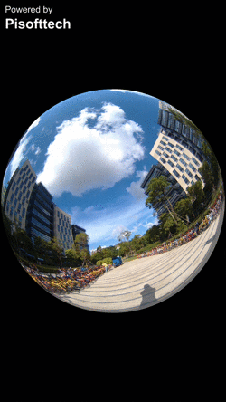

# PiPanoSDK-iOS
## Brief


[中文版](https://github.com/pisofttech/pipano-sdk-ios/blob/master/README-cn.md)

PiPanoSDK is a set of software development kits designed to process panoramic images with the following features:

1.Browse images, play video and preview device video stream;

2.Support source mode includeing OneEye, TwoEye and Full21;

3.Support various view modes: Immerse, FishEye, Asteroid, Cylinder, VR, TwoScroll, etc ;

4.Support various filter effects: Bleach, Charcoal, Contours, Blueberry, Pixelated, etc ;

5.Support a set of transition animations: Flip, Fade, Gate, Circle, Fold , etc ;

 

 


## Integrate into Xcode

[Integrate PiPanoSDK into Xcode](https://github.com/pisofttech/pipano-sdk-ios/blob/master/integrate-into-xcode.md)


## Demo

Scan QR code


or download link: [App Store](http://itunes.apple.com/app/id1290710793)


## Basic Usage

### 1.Import Headers

Import the framework main Header file `PiPanoSDK.h`

```objective-c
#import <PiPanoSDKComplete/PiPanoSDK.h>
```


### 2.Get PiPano Camera View

Call method `getCameraView` to get the camera View. PiPano will render the panorama in this View, and also  with some input operations.

```objective-c
UIView* piCameraView = [PiPano getCameraView];

//put cameraView into a father view
[superPICameraView setBounds:[[UIScreen mainScreen] bounds]];
[superPICameraView addSubview:piCameraView];
```


### 3.On Ready Event

PiPano initialization takes a bit of time. After completion, there will be a block callback. Sample code:

```objective-c
[PiPano onPiPanoSDKReady:^()
{
   NSLog(@"SDK is ok !");
}];
```


### 4.Browse panorama image&video

Call method `openPhoto` to browse panorama image. Sample code:

```objective-c
- (void)openPhoto:(id)sender
{
    NSString* photoPath = [[NSBundle mainBundle] pathForResource:@"testRes/one_eye_image" ofType:@"jpg"];
    [PiPano openPhoto:photoPath sourceMode: PISM_OneEye];
}
```


Call method `openVideo` to browse panorama image. Sample code:

```objective-c
- (void)openPhoto:(id)sender
{
    NSString* videoPath = [[NSBundle mainBundle] pathForResource:@"testRes/two_eye_video" ofType:@"mp4"];
    [PiPano openVideo:videoPath  sourceMode: PISM_TwoEye];
}
```
